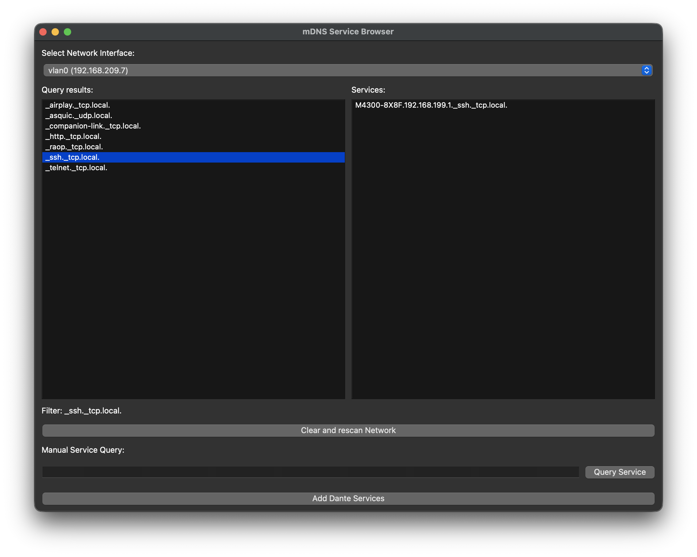

# mDNS Service Browser (Async, PyQt6)

A cross-platform **mDNS / DNS-SD service discovery tool** built with **PyQt6** and Python’s **asyncio Zeroconf API**.  
It allows you to browse, filter, and inspect network services (including **Dante audio devices**) in real time.



---

## ✨ Features

- 🔍 **Automatic discovery** of all mDNS service types (`_services._dns-sd._udp.local.`)  
- 🎚️ **Filter and browse** discovered service instances per type  
- 📜 **Detailed service info** including addresses, TXT properties, priority, weight  
- 🌐 **Interface selection** – scan on a specific interface or all interfaces  
- 🔄 **Rescan & refresh** with one click  
- 📝 **Manual service query** with auto-correction for `.local.` suffix  
- 🎵 **Quick Dante queries** for `_netaudio._udp.local.` etc.  
- ✅ Cross-platform (Linux, macOS, Windows)

---

## 🚀 Installation

### Requirements
- Python **3.9+**
- [python-zeroconf](https://github.com/jstasiak/python-zeroconf) (newer versions with `AsyncZeroconf`)
- [PyQt6](https://pypi.org/project/PyQt6/)
- [psutil](https://pypi.org/project/psutil/)

### Install dependencies
```bash
pip install -r requirements
```

---

## ▶️ Usage

Run the app:

```bash
python src/app.py
```

or build an executable with the spec files 

### Basic workflow
1. Select an interface (`All interfaces` or a specific adapter/IP).  
2. Watch available **service types** appear in the left panel.  
3. Select a type to filter and view discovered **services** on the right panel.  
4. Click a service to open a detailed info dialog with TXT records.  
5. Use **Manual Query** to search for a service type (input auto-corrects `.local.`).  
6. Use **Query Dante Services** to automatically query common Dante services. (Because some Dante devices don't respond on the default service query)  

---

## 🛠️ Development Notes

- Uses `AsyncZeroconf` for async service browsing.  
- Runs an `asyncio` event loop in a background thread.  
- Communicates with the PyQt6 main thread via Qt signals for **thread-safe UI updates**.  
- Service resolution uses `async_get_service_info()` with a timeout of **3s**, retriable if needed.  
- Input normalization ensures user queries work even if `.local.` is missing.  

---

## 📦 Project Structure
```
src/
  app.py         # Main PyQt6 app and AsyncZCWorker
README.md
```

---

## 🔮 Roadmap
- [ ] Add **collapsible properties section** in service info dialog  
- [ ] Retry resolution for slow-responding devices  
- [ ] Configurable list of **favorite service types** (like Dante)  
- [ ] Dark/light theme toggle  

---

## 📜 License
MIT © 2025 Thorsten Wagener 
